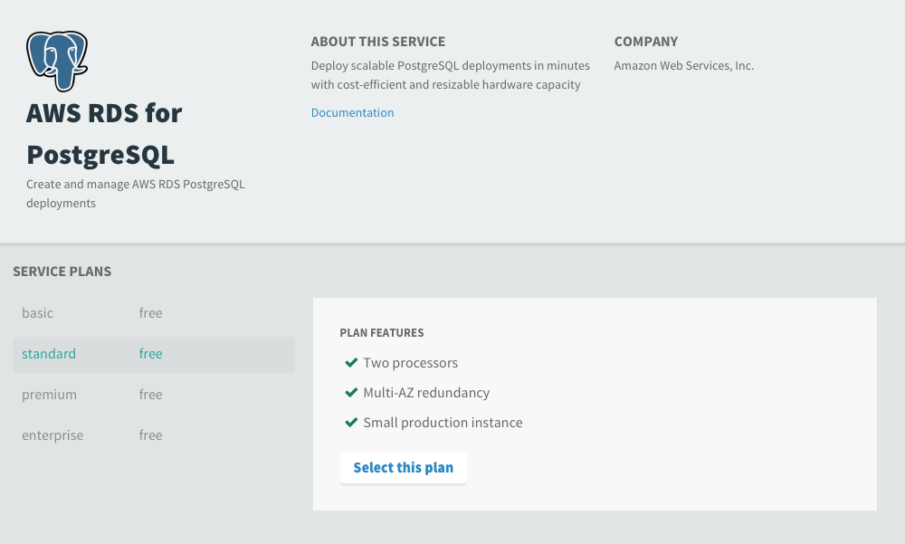

##Overview
The Service Broker for AWS makes it easy for PCF operators and App developers to set up, operate and scale AWS resources from within PCF. 

PCF operators can set up pre-defined service plans (resource configurations) and securely manage their AWS credentials. 

App Developers can create AWS resoruces with one CLI command and if needed can supply additional configuration parameters at provision, update and bind times.  

##Security
The PCF operator sets up an IAM account and policy and provides credentials to the Service Broker. App Developers do not need access to the credentials to create service instances. 

##Available Services
AWS has a number of services that will be made available via the Service Broker for AWS. 
During installation, the PCF operator will configure which services they want to make available in the Marketplace. 

The current version supports the following services:

* RDS for PostgreSQL - Amazon RDS supports DB instances running several versions of PostgreSQL. 
* S3 - Create and manage Amazon S3 buckets

##Apps Manager
Note: Apps Manager does not yet support the Asynchronous Provisioning capability of Cloud Foundry so it can NOT be used to Create or Delete service instances. You can view the Marketplace services, the Service Plans for each service and their plan features. However, the Create, Delete, Bind and Unbind must be done via the CF CLI.  

##RDS for PostgreSQL
As with all PCF Services, you can list the services in the Marketplaces:

    cf marketplace
    Getting services from marketplace in org system / space iaas-brokers as admin...
    OK
    service            plans                                  description   
    app-autoscaler     bronze, gold                           Scales bound applications in response to load   
    aws-rds-postgres   basic, standard, premium, enterprise   Create and manage AWS RDS PostgreSQL deployments   

TIP:  Use 'cf marketplace -s SERVICE' to view descriptions of individual plans of a given service.

And you can view the available plan details:

    cf marketplace -s aws-rds-postgres
    Getting service plan information for service aws-rds-postgres as admin...
    OK

    service plan   description                                               free or paid   
    basic          For small projects and during development.                free   
    standard       For a small production database, multi-AZ, 2vCPU, 7.5GB   free   
    premium        For a mid-sized database, multi-AZ, 4 vCPU, 15GB          free   
    enterprise     For a large database, multi-AZ, 8 vCPU, 32GB              free

It is extremely simple to create a postgres database instance using one of the service plans:

    cf create-service aws-rds-postgres standard mypostgres1

An App developer can provide custom settings for the following elements when creating a service instance:

* Engine Version
* Multi-AZ
* Storage Type
* AllocatedStorage
* AvailabilityZone

The following command shows the syntax for each setting, you can omit settings you don't want to explicitly set:

    cf create-service aws-rds-postgres basic postgresdb -c '{ "CreateInstance": { "EngineVersion": "9.4.1", "MultiAZ": false, "StorageType": "gp2", "AllocatedStorage": 10, "AvailabilityZone": "us-east-1a", "Tags": [{"Key": "owner", "Value": "operations"}, {"Key": "Env", "Value": "staging"} ] } }'

###Binding to an Application
This step grants the application with access to the database and provides credentials (in the environment variables) for access. 
The access permissions are set at the least privilege required.  

    cf bind-service myapp mydb

###Unbinding an Application
This step removes application access to the database and removes the database credentials from the environment variables. 

    cf unbind-service myapp mydb

###Deleting Service Instances
To delete the service instance, ensure that there are no apps bound to the service instance.  

    cf delete-service mydb
    Really delete the service mydb> y
     Deleting service mydb in org system / space dev1 as appdev1...
     OK
     Delete in progress. Use 'cf services' or 'cf service mydb1' to check operation status.

##S3
Creating an S3 bucket is simple. It will utilize default region and tags settings configured by the PCF operator:

    cf cs aws-s3 standard bucket1

You can create a bucket in a specific region, very useful for ensuring lower latency for end users. The following example creates a bucket in the Tokyo region:

    cf cs aws-s3 standard tokyobucket -c '{ "CreateBucket": { "CreateBucketConfiguration": { "LocationConstraint": "ap-northeast-1"} } }'

##Troubleshooting Problems
1. As a PCF operator, when deploying the tile by clicking "Apply Changes" I get an error "A client error (InvalidClientTokenId) occurred when calling the GetUser operation: The security token included in the request is invalid." Reason: The AWS credentials are not valid, please recheck them or recreate the credentials. 
2. As a PCF operator, when deleting the product tile, I get an error "Can not remove brokers that have associated service instances". Reason: Your service broker currently has service instances that are active. They must be deleted before the tile can be deleted. 
2. As an App developer, when trying to create a service, I get an error "Service broker error: InvalidClientTokenId: The security token included in the request is invalid." Reason: The AWS credentials are not valid, please ask your PCF operator to recheck them or recreate the credentials.

